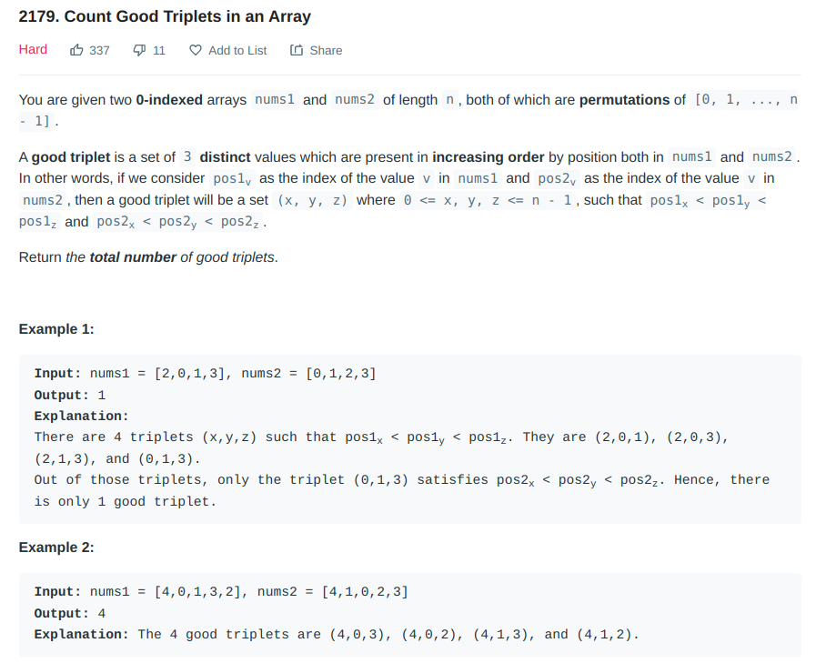
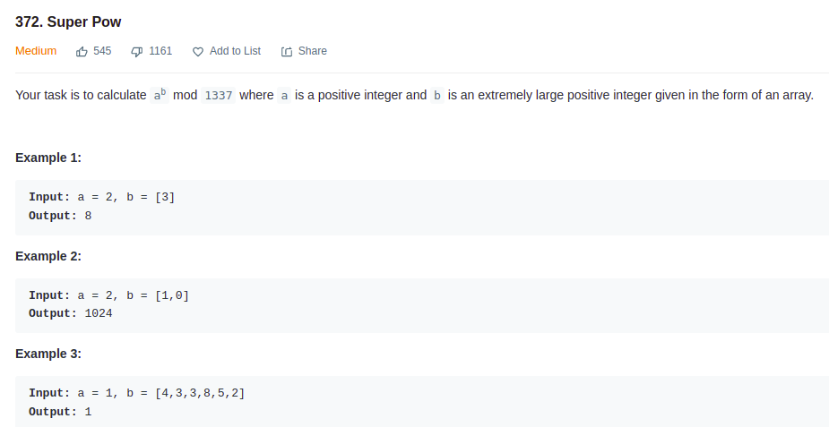
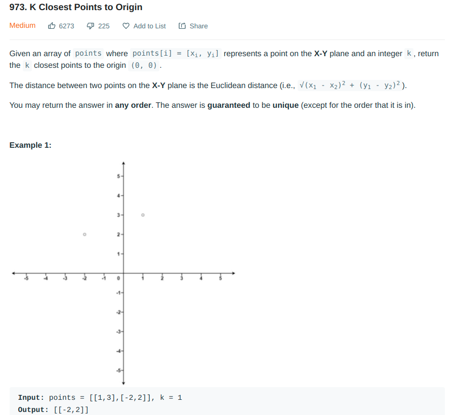

# Exercicios DC

**Número da Lista**: 3 
**Conteúdo da Disciplina**: DC 

## Alunos

| Matrícula | Aluno                   |
| --------- | ----------------------- |
| 190046091 | Gustave Augusto Persijn |
| 190032863 | Lorrayne Cardozo Alves  |

## Sobre

Para aplicar os conhecimentos sobre Dividir e Conquistar, foram resolvidas 3 questões do juiz online LeetCoder, sendo elas:

[Questão 1](https://leetcode.com/problems/count-good-triplets-in-an-array/)  
[Questão 2](https://leetcode.com/problems/super-pow/)  
[Questão 3](https://leetcode.com/problems/k-closest-points-to-origin/)  

## Screenshots

### Questão 1

### Questão 2

### Questão 3

## Instalação

**Linguagem**: Python e Java 

## Uso

É necessário submeter o código no LeetCode.
Basta enviar os códigos encontrados no repositório e enviá-los nos links das questões acima.
